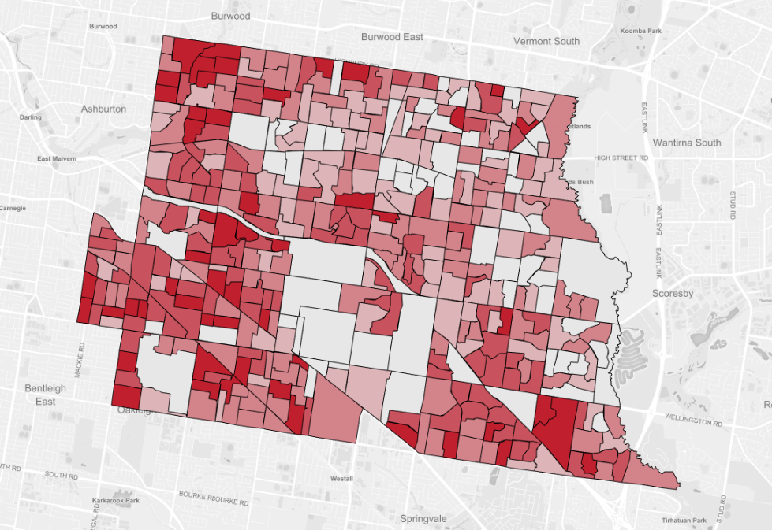

# Location Decisions Front-end challenge

## Description
Render a map and display supplied Polygons. Once polygons have been rendered, apply the supplied fill colour to each polygon.

## JSON Endpoints
- Geo endpoint - Polygons can be found here (json): [Geometries (polygons)](http://geo-exercise.id.com.au/api/geo)
- Data endpoint - Fill colours can be found here (json): [Data (fill colours)](http://geo-exercise.id.com.au/api/data)

## Tools to use
- Javascript frameworks --> AngularJs or Angular 2 onwards
- Mapping tool --> Leaflet (https://leafletjs.com/)

## Helpers
Here is the method to decode the polygon points in the shapes array within the geo json endpoint. It will return an array of Latitude, Longitude objects

https://gist.github.com/Zir01/9ce6c17f8d773b2f23d5c8410b0c6e19#file-decodepoints-js

Polygons are found in the http://geo-exercise.id.com.au/api/geo endpoint. Within this Json object you will find an array of shapes. A shape looks like this:

https://gist.github.com/Zir01/67c5fc4966b4d18773f85100b49428ab#file-shape-json

The important parts of this object are the "id" and "points" properties. The "points" property is an
array of Latitude and Longitude objects encoded (it is encoded to reduce the size of the polygon).
Decode it using the above decodePoints function. Use the "id" property to assign a colour supplied by
the /api/data endpoint. In this case the polygon id is "2118001"
**NOTE: Make sure Latitude/Longitude values are not switched in the opposite order**

Colours are found in the http://geo-exercise.id.com.au/api/data endpoint. Look inside the "data" array. Each shape above will have an entry within the data array. It looks like this:

https://gist.github.com/Zir01/b85cab9bd85eea8f455baf7f4b6adf5e#file-data-json

Note how the data entry for the above shape has a "GeoID" of "2118001". You can use either "cA", "cR", "cG", "cB" or "color" properties to fill the polygon
You can also use the "InfoBox" object to create a roll over on each polygon.

The result should look similar to this:

## Questions?
Please contact us here: bruce@id.com.au to ask any questions about the challenge.

